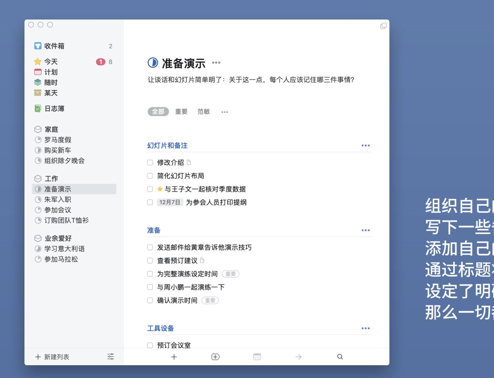

# Tools
## Launch: 
- 自动唤出终端
- 一个界面显示文档
- 一个界面用来实现命令行参数的自动生成
  ```
  python train.py -batch_size=50 -lr=0.3 -weight_decay=0.2
  ```
  如上，可以通过对于以下表单的填写 通过点击生成Button直接在命令复制到粘贴板中
  ```
  语言: python cpp
  参数以及对应的值: 通过一个new按钮打开一个新窗口 窗口包含参数、值两个
  ```
# Papers:
## Paper
- 一个界面显示论文对应的pdf (较大布局， 居中)
- 一个界面用来记录对应的笔记 (位于右边)
## Code
- 打开论文对应的文件夹

<!-- # Plan
- 类似于things3的任务设计
   -->

  
